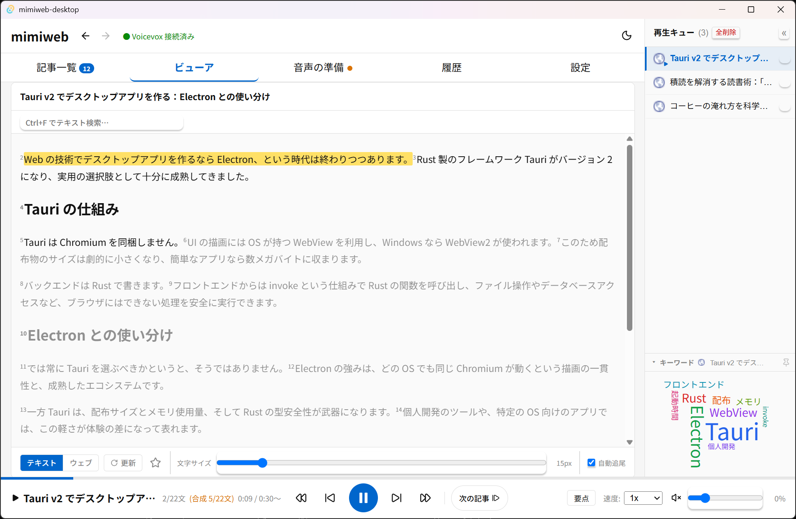
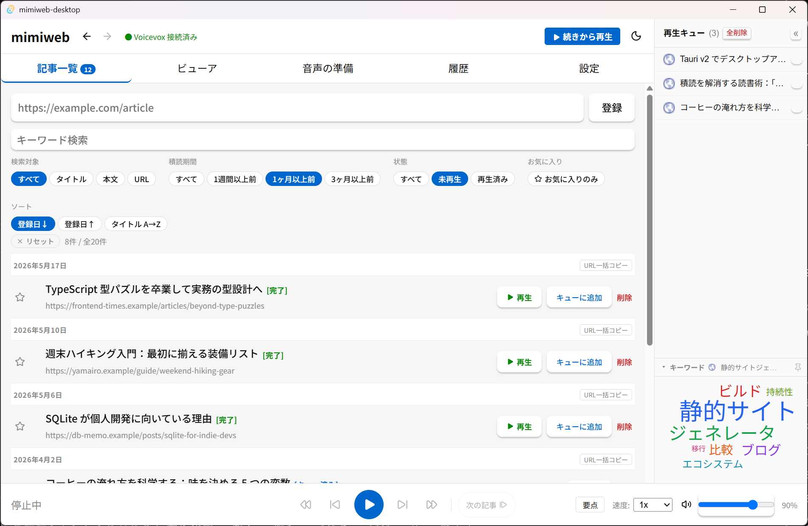
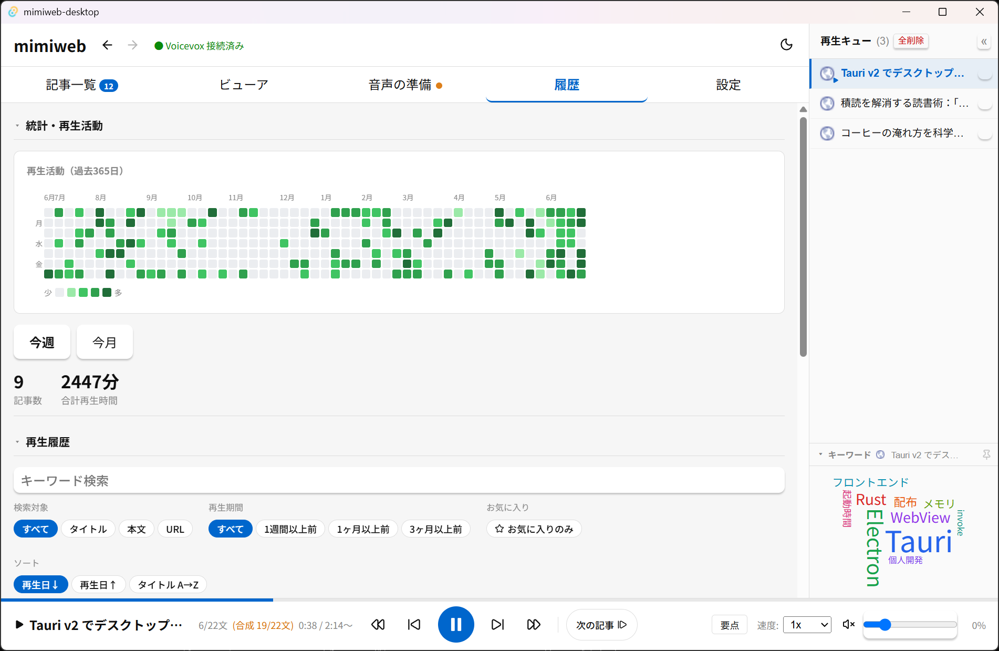
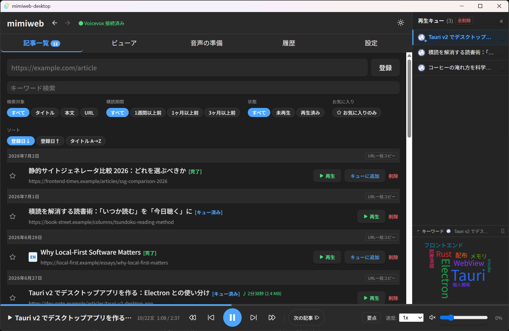

# mimiweb-desktop

[日本語](./README.md) | **English**

[](./LICENSE)
[](https://github.com/ysmz334/mimiweb-desktop/releases/latest)
[](https://github.com/ysmz334/mimiweb-desktop/releases)


**Your read-it-later list is where articles go to die. Digest them by ear instead.**

Do you keep saving articles you never actually read?
mimiweb-desktop is a free Windows app that reads your backlog of web articles aloud with high-quality neural TTS — VOICEVOX for Japanese and Piper for English.
Just paste a URL. Your unread pile shrinks while you do chores or focus on other work.



---

## Who this is for

- Your read-it-later service or bookmarks keep growing and nothing gets read
- Your ears are free while you work at your PC or do housework
- Built-in browser read-aloud isn't enough — you want better voices and proper article management

## Features for digesting your backlog

**Collect** — Just paste a URL. Clipboard monitoring auto-detects copied links. Article text is extracted automatically with a reader view (multi-page articles are merged)

**Rediscover** — The *backlog filter* digs up articles you have left untouched for 1 week / 1 month / 3+ months. Unread badge, keyword search, favorites

**Listen** — Natural Japanese speech with VOICEVOX and English speech with Piper TTS (language auto-detected). The text viewer highlights each sentence as it is read. Drag & drop to reorder the playback queue

**Save time** — "Key points" mode reads only the important sentences selected by TF-IDF. Background synthesis eliminates waiting

**Look back** — A GitHub-style calendar heatmap visualizes your listening streaks, plus playback history, stats, and word clouds

Also: light/dark theme, customizable keybindings, and fully local operation (articles, audio, and history never leave your machine).

## Screenshots

> All articles shown are fictional samples.

**Digging up unplayed articles registered more than a month ago:**



**A calendar heatmap of your listening activity:**



**Dark theme:**



---

## Requirements

| Item | Requirement |
|---|---|
| OS | Windows 10 / 11 (64-bit) |
| WebView2 | Preinstalled on Windows 11. On Windows 10, install from [here](https://developer.microsoft.com/en-us/microsoft-edge/webview2/) |
| Disk | About 1 GB (including the VOICEVOX engine) |

> **Note:** The app UI is currently Japanese-only. English articles are fully supported for playback (auto-detected and read with Piper TTS).

---

## Installation

### Installer (recommended)

1. Download `mimiweb-desktop-x.x.x-windows-x64-setup.exe` from the [latest release](https://github.com/ysmz334/mimiweb-desktop/releases/latest)
2. Run the installer
3. Launch from the desktop shortcut

### Portable

1. Download `mimiweb-desktop-x.x.x-windows-x64.zip`
2. Extract anywhere
3. Run `mimiweb-desktop.exe`

### Verify checksums (optional)

```powershell
(Get-FileHash "mimiweb-desktop-x.x.x-windows-x64.zip" -Algorithm SHA256).Hash
```

Compare against the values in `SHA256SUMS.txt`.

---

## First-run setup

### VOICEVOX engine (Japanese TTS)

If the engine is not found at startup, a setup screen appears automatically.
Click the download button to fetch and extract it (about 400 MB).

### Piper TTS (English TTS)

Only needed if you want English article playback.
Go to Settings → "英語 TTS (Piper)" → download (about 100 MB).

---

## Notes

### Windows SmartScreen warning

Because the app is not code-signed, Windows shows a "Windows protected your PC" warning on first install.
Click "More info" → "Run anyway" to proceed.
(The full source code is public in this repository, and checksums for every release asset are published.)

### VOICEVOX character license terms

Each VOICEVOX character voice has its own terms of use.
Please check the [VOICEVOX official site](https://voicevox.hiroshiba.jp/) and the individual character terms before use.

---

## Data storage

Everything is stored locally. No data is sent to external servers (except the version check).

| Data | Location |
|---|---|
| Database | `%APPDATA%\com.mimiweb.desktop\mimiweb.db` |
| Logs | `%APPDATA%\com.mimiweb.desktop\logs\` |
| Audio cache | IndexedDB (WebView2) |

The `%APPDATA%\com.mimiweb.desktop\` folder remains after uninstalling; delete it manually if you no longer need it.

---

## Building from source

See [docs/build.md](./docs/build.md) for development setup and build instructions (Japanese).

---

## License

The application source code is released under the **MIT License**. See [LICENSE](./LICENSE).

### Third-party libraries

| Library | License |
|---|---|
| [Piper TTS](https://github.com/rhasspy/piper) | MIT © Rhasspy contributors |
| [en_US-ryan-high voice](https://huggingface.co/rhasspy/piper-voices) | **CC BY 4.0** © Rhasspy contributors |
| [VOICEVOX](https://voicevox.hiroshiba.jp/) | MIT © Hiroshiba Kazuyuki |
| [@mozilla/readability](https://github.com/mozilla/readability) | Apache 2.0 © Mozilla Foundation |
| [lamejs](https://github.com/zhuker/lamejs) | LGPL 3.0 © zhuker |
| [Tauri](https://tauri.app/) | MIT / Apache 2.0 © Tauri Programme |
| [lindera](https://github.com/lindera/lindera) | MIT / Apache 2.0 |
| [rust-stemmers](https://github.com/CurrySoftware/rust-stemmers) | MIT / Apache 2.0 |
| [d3-cloud](https://github.com/jasondavies/d3-cloud) | MIT © Jason Davies |
| [React](https://react.dev/) | MIT © Meta Platforms, Inc. |

See [NOTICE.md](./NOTICE.md) for details.

---

## About the development

This app was developed in conversation with [Claude Code](https://www.anthropic.com/claude-code), Anthropic's AI coding agent.

---

## Bug reports & feature requests

Please use [GitHub Issues](https://github.com/ysmz334/mimiweb-desktop/issues).
Attaching log files (`%APPDATA%\com.mimiweb.desktop\logs\`) helps a lot.
